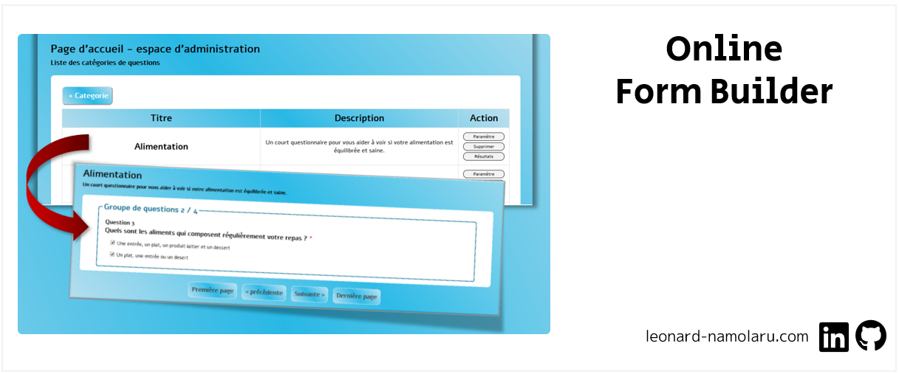

### [Français] Application Web (JavaEE) – Création et gestion de formulaires
> :school: **Lieu de formation :** Université Paris Cité (Campus Saint-Germain-des-Prés, ex-Paris Descartes) 
> 
> :books: **UE :** Projet de programmation 
> 
> :pushpin: **Année scolaire :** L2
> 
> :calendar: **Dates :** janv. 2020 - avr. 2020 
> 
> :chart_with_upwards_trend: **Note :** 16/20

#### Principales fonctionnalités
- Création d’un nombre illimité de formulaires.
- Les questions d’un formulaire peuvent être divisées en plusieurs groupes. Chaque groupe de questions est présenté sur une page distincte.
- Les questions d'un formulaire peuvent être de différents types : champ de texte, boutons radio, cases à cocher, liste d’options, etc.
- Il est possible de donner à l’utilisateur un score pour pour avoir choisi une certaine option.
- A la fin du questionnaire, l’utilisateur voit son score final.
- Système d’inscription et de connexion avec deux types d’utilisateurs : utilisateur et administrateur.
- Un utilisateur peut s’inscrire, se connecter, répondre à des questionnaires et modifier ses données personnelles. De plus, il existe un bouton dédié en cas d’oubli du mot de passe.
- L’administrateur peut ajouter des questionnaires, modifier un questionnaire existant, visualiser les résultats du questionnaire sous la forme d’un graphe, consulter la liste des utilisateurs, modifier leurs coordonnées, supprimer un utilisateur, supprimer un formulaire.

#### Démonstration 
Video : https://www.youtube.com/watch?v=CdCUxKj7Z4o

